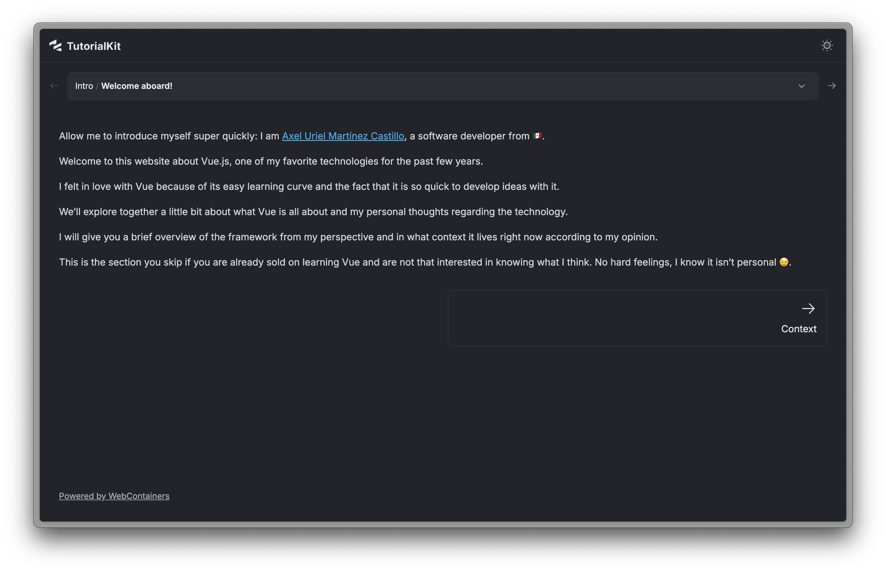
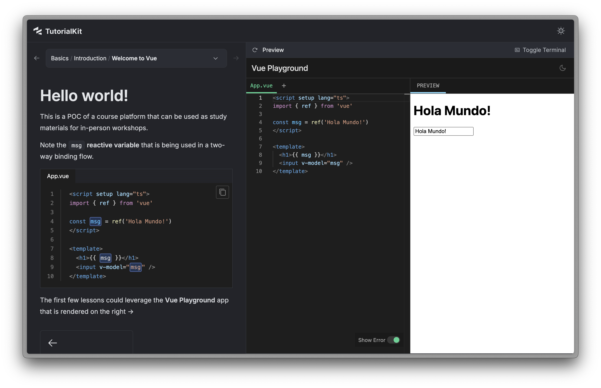

# amoxtli-vue

> **[ah-MOX-tlee](https://nahuatl.wired-humanities.org/content/amoxtli)** in Nahuatl means book. So this is the book of Vue.

This is a spiritual successor to [notes-on-vue](https://notes-on-vue.ackzell.dev). The goal is to provide a multimedia and interactive experience that will cater to different learning styles, with emphasis on the hands-on aspect which the original site attempted to accomplish via CodePen embeds, but it always lacked the sense of a "real" environment where to try Vue.

## Text
Same as with the original project, text based and "blog post" style content.


## Video content
We should be able to add video content. It can showcase interesting talks, particular concepts explained or even video content made explicitly as a resource to this project. eg. recorded sessions / video course.

## Interactive Playground
Besides the obvious feature why to choose [TutorialKit](https://tutorialkit.dev/) for this project ([WebContainers](https://webcontainers.io/)) Vue itself also [has a REPL](https://github.com/vuejs/repl) that when placed in a _Preview_ pane can act as a perfect companion to allow "students" to get their hands on the framework immediately. This should be really good for the very basics, providing an environment with the "sample" code for each concept, but also providing a way for users to experiment on their own without distractions.


> [!note]
> The [`yehyecoa-vue`](https://github.com/ackzell/yehyecoa-vue/issues/1#issuecomment-3191337879) repo has more details on how this integration works.

## On using Vue
This project also employs the [Vue.js integration](https://docs.astro.build/en/guides/integrations-guide/vue/) for [Astro](https://docs.astro.build/en/guides/integrations-guide/), so you will find I sprinkled some custom components built in Vue.

## Astro modifications
Since tk is itself based on [astro](https://astro.build/), there are things we can do like adding a login to the project.
Note that tk (as far as my understanding goes and after a couple days trying to figure it out) doesn't provide a way to protect the tutorial content behind a login on its own, in addition to that, the content will always be generated statically, which means we can't check for authorization on the content pages dynamically. So my solution thus far is to employ [Supabase Auth](https://supabase.com/auth) and [Netlify functions / edge functions ](https://docs.netlify.com/start/core-concepts/primitives) to protect the content.

I think the code is self explanatory and it can be followed but the quick rundown is:
* User logs in (currently only GitHub login is implemented)
* Supabase authenticates the user
* When reaching the redirect to `auth/callback` it sets a `sb_token` cookie on the user's browser
* There are `/public` and `/protected` functions that are called "in order" (see [`netlify.toml`](./netlify.toml) file) and "direct" the traffic
* If the user isn't logged in, the protected route will redirect the user straight to the login page
* The TopBar.ts component has been [overridden](https://tutorialkit.dev/guides/overriding-components/) to also present a [logout button](./src/components/LogoutButton.vue) Vue component

> [!Warning]
> Right now, the only way to get tk running with the different modifications I made to the styles is by using my own fork of the library. I created [a PR](https://github.com/stackblitz/tutorialkit/pull/467) on the official repo, but given the current state of other contributions I am not entirely sure this will be merged soon. I will update this Readme if we are ever able to use more modern versions of UnoCSS directly.

You will find in the package.json file that I have overrides such as:
```json
  "pnpm": {
    "overrides": {
      "@tutorialkit/astro": "file:../../oss/tutorialkit/packages/astro",
      "@tutorialkit/react": "file:../../oss/tutorialkit/packages/react",
      "@tutorialkit/runtime": "file:../../oss/tutorialkit/packages/runtime",
      "@tutorialkit/theme": "file:../../oss/tutorialkit/packages/theme",
      "@tutorialkit/types": "file:../../oss/tutorialkit/packages/types"
    }
  }
```
This means that I build tk locally to then install it (also locally) onto the `amoxtli-vue` project. 
Deploys are done via [`netlify cli`](https://docs.netlify.com/api-and-cli-guides/cli-guides/get-started-with-cli/) ( with `netlify deploy`) and this means that remote CI pipelines / merge to deploy are not quite working at this stage. I tried my best, but it would require some more work and I should be writing content instead of fighting that battle.

I'll create a GH issue to fix this eventually.

# Original Readme

# TutorialKit Starter

👋 Welcome to TutorialKit!

This README includes everything you need to start writing your tutorial content quickly.

## Project Structure

```bash
.
├── astro.config.mjs    # TutorialKit uses Astro 🚀 (https://astro.build)
├── src
│   ├── ...
│   ├── content
│   │   └── tutorial    # Your tutorial content lives here
│   └── templates       # Your templates (see below for more information)
├── public
│   ├── favicon.svg
│   └── logo.svg        # Default logo used in top left for your tutorial
├── ...
├── theme.ts            # Customize the theme of the tutorial
└── uno.config.ts       # UnoCSS config (https://unocss.dev/)
```

## Getting Started

Make sure you have all dependencies installed and started the dev server:

```bash
pnpm install
pnpm run dev
```

## UI Structure

```markdown
┌─────────────────────────────────────────────────────┐
│ ● ● ●                                               │
├───────────────────────────┬─────────────────────────┤
│                           │                         │
│                           │                         │
│                           │                         │
│                           │                         │
│                           │       Code Editor       │
│                           │                         │
│                           │                         │
│                           │                         │
│                           │                         │
│          Content          ├─────────────────────────┤
│                           │                         │
│                           │                         │
│                           │  Preview & Boot Screen  │
│                           │                         │
│                           │                         │
│                           ├─────────────────────────┤
│                           │                         │
│                           │        Terminal         │
│                           │                         │
└───────────────────────────┴─────────────────────────┘
```

## Authoring Content

A tutorial consists of parts, chapters, and lessons. For example:

- Part 1: Basics of Vite
  - Chapter 1: Introduction
    - Lesson 1: Welcome!
    - Lesson 2: Why Vite?
    - …
  - Chapter 2: Your first Vite project
- Part 2: CLI
  - …

Your content is organized into lessons, with chapters and parts providing a structure and defining common metadata for these lessons.

Here’s an example of how it would look like in `src/content/tutorial`:

```bash
tutorial
├── 1-basics-of-vite
│   ├── 1-introduction
│   │   ├── 1-welcome
│   │   │   ├── content.md    # The content of your lesson
│   │   │   ├── _files        # Initial set of files
│   │   │   │   └── ...
│   │   │   └── _solution     # Solution of the lesson
│   │   │       └── ...
│   │   ├── 2-why-vite
│   │   │   ├── content.md
│   │   │   └── _files
│   │   │       └── ...
│   │   └── meta.md           # Metadata for the chapter
│   └── meta.md               # Metadata for the part
├── 2-advanced
│   ├── ...
│   └── meta.md
└── meta.md                   # Metadata for the tutorial
```

### Supported Content Formats

Content can be either written as Markdown (`.md`) files or using [MDX](https://mdxjs.com/) (`.mdx`). Files have a Front Matter at the top that contains the metadata and everything that comes after is the content of your lesson.

**Example**

```markdown
---
type: lesson
title: Welcome!
---

# Welcome to TutorialKit!

In this tutorial we'll walk you through how to setup your environment to
write your first tutorial 🤩
```

The metadata file (`meta.md`) of parts, chapters, and lessons do not contain any content. It only contains the Front Matter for configuration.

### Metadata

Here is an overview of the properties that can be used as part of the Front Matter:

| Property        | Required | Type                        | Inherited | Description                                                                                                                                           |
| --------------- | -------- | --------------------------- | --------- | ----------------------------------------------------------------------------------------------------------------------------------------------------- |
| type            | ✅       | `part \| chapter \| lesson` | ❌        | The type of the metadata.                                                                                                                             |
| title           | ✅       | `string`                    | ❌        | The title of the part, chapter, or lesson.                                                                                                            |
| slug            |          | `string`                    | ❌        | Let’s you customize the URL pathname which is `/:partSlug/:chapterSlug/:lessonSlug`.                                                                  |
| previews        |          | `Preview[]`                 | ✅        | Configure which ports should be used for the previews. If not specified, the lowest port will be used.                                                |
| autoReload      |          | `boolean`                   | ✅        | Navigating to a lesson that specifies `autoReload` will always reload the preview. This is typically only needed if your server does not support HMR. |
| prepareCommands |          | `Command[]`                 | ✅        | List of commands to execute sequentially. They are typically used to install dependencies or to run scripts.                                          |
| mainCommand     |          | `Command`                   | ✅        | The main command to be executed. This command will run after the `prepareCommands`.                                                                   |

A `Command` has the following shape:

```ts
string | [command: string, title: string] | { command: string, title: string }
```

The `title` is used as part of the boot screen (see [UI Structure](#ui-structure)).

A `Preview` has the following shape:

```ts
string | [port: number, title: string] | { port: number, title: string }
```

In most cases, metadata is inherited. For example, if you specify a `mainCommand` on a chapter without specifying it on any of its lessons, each lesson will use the `mainCommand` from its respective chapter. This extends to chapter and parts as well.
